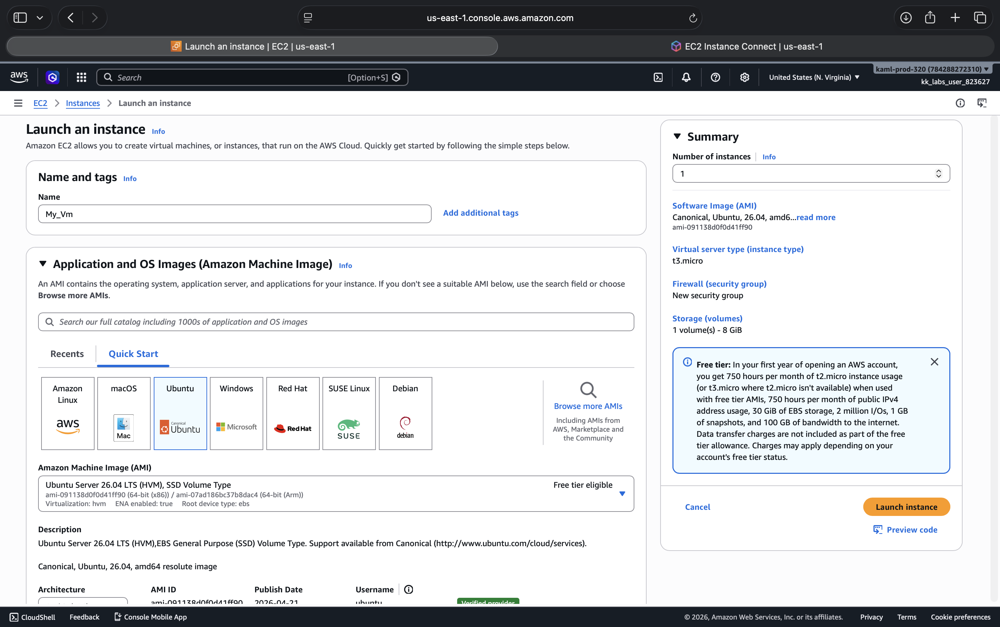
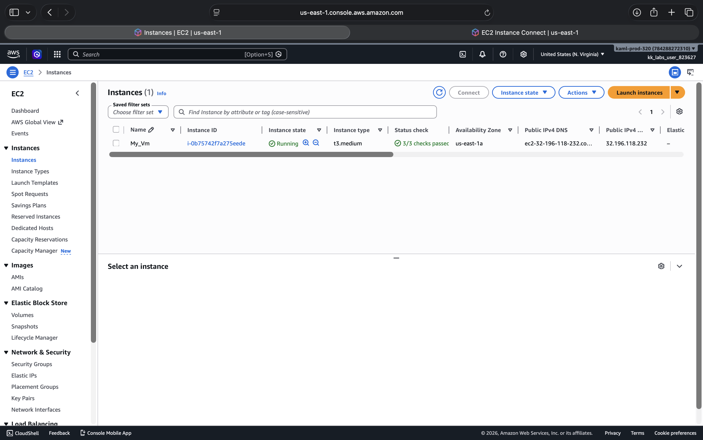
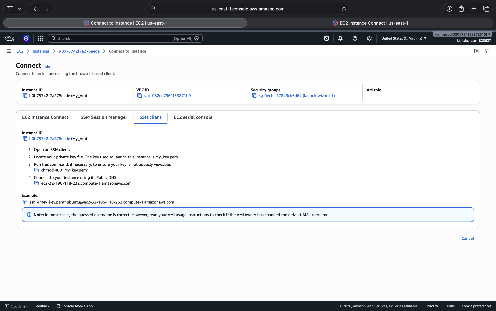
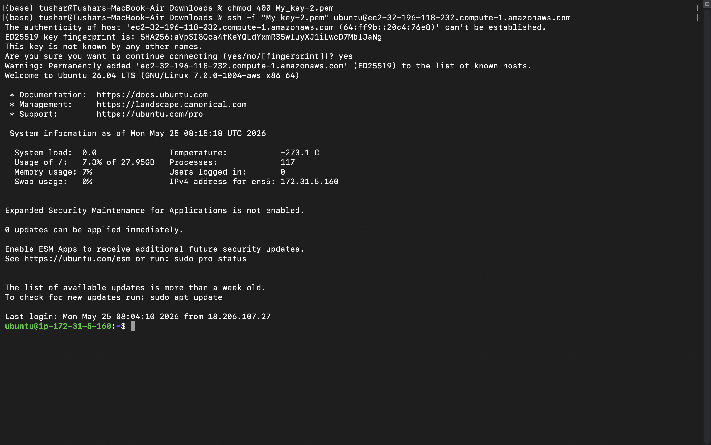
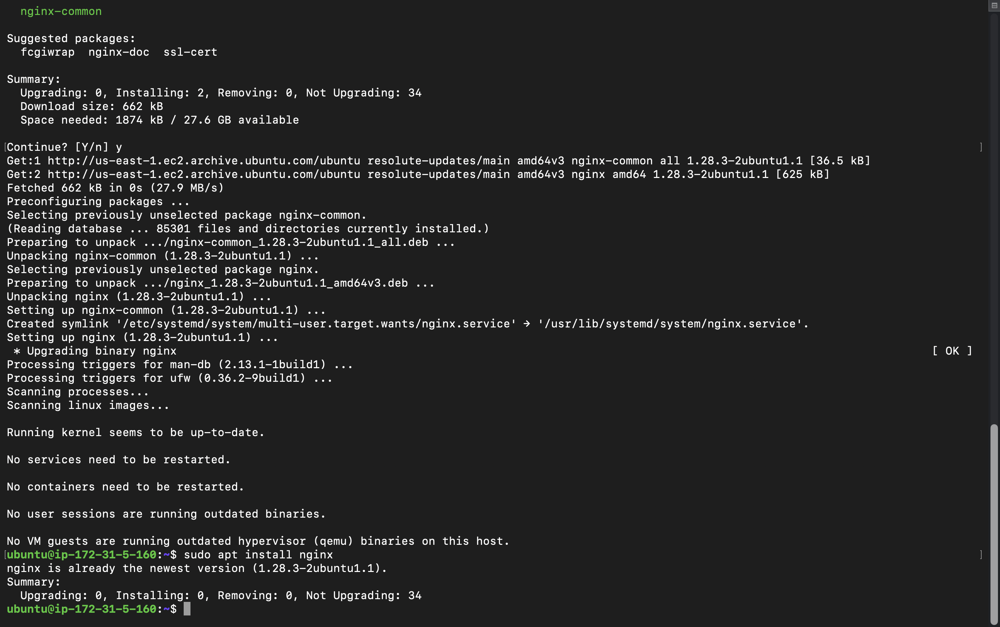
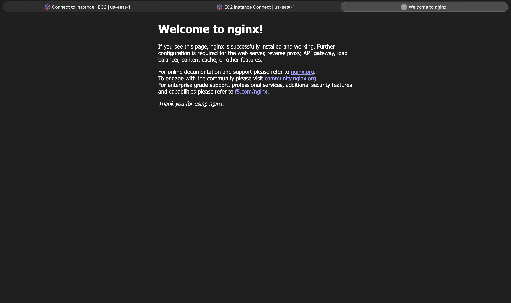
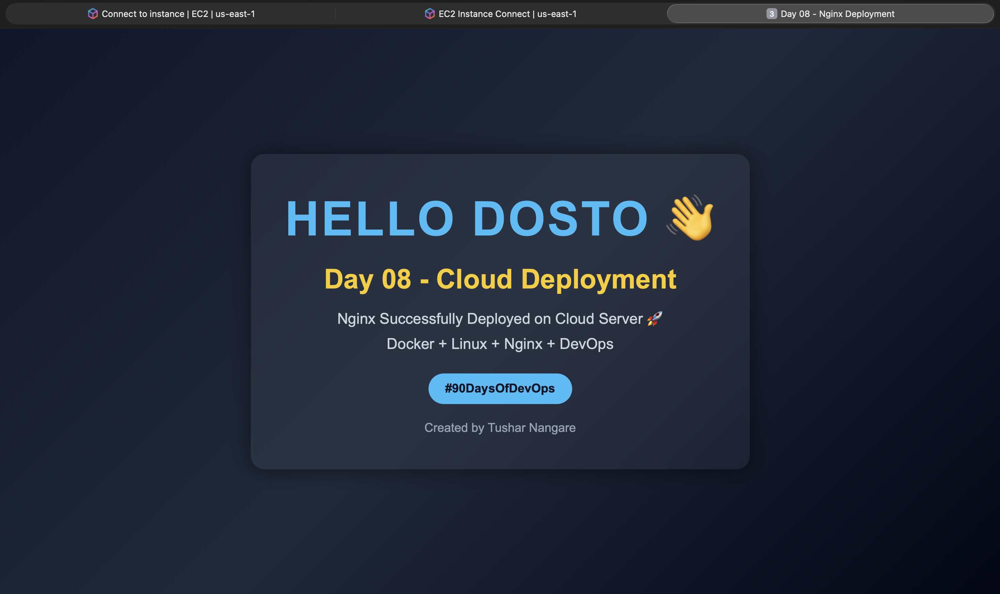
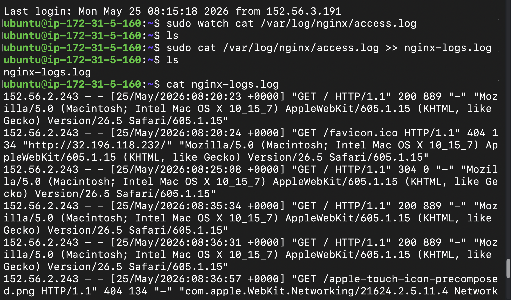

# Day 08 – Cloud Server Setup: Docker, Nginx & Web Deployment

## Introduction

Today was one of the most exciting and practical days in my DevOps journey so far.

Until now, most of my learning was happening locally on my machine:
- Linux commands
- Docker basics
- Logs
- Services
- Troubleshooting

But today was completely different.

Today I deployed a real cloud server and hosted a webpage publicly on the internet.

This was my first proper cloud deployment experience where I:
- Created an AWS EC2 instance
- Connected remotely using SSH
- Installed Docker and Nginx
- Configured security groups
- Hosted a custom webpage
- Worked with logs
- Managed a real Linux server on cloud

For the first time, it truly felt like real DevOps work instead of only local practice.

---

# Launching My First EC2 Instance

I used AWS EC2 to create a cloud server.

While launching the instance, I selected:
- Ubuntu Server
- t2.micro instance
- SSH access enabled

I also downloaded a `.pem` key file which is required for secure SSH authentication.

One thing I realized today:

> Cloud servers are simply Linux systems running remotely on the internet.

That understanding made cloud computing feel much less complicated.

---

## EC2 Launch Configuration



---

# Understanding EC2 Dashboard

After launching the server, I explored the EC2 dashboard.

There I could see:
- Public IP address
- Instance status
- Security groups
- Network details
- Storage information

This helped me understand how cloud infrastructure is managed visually before interacting through the terminal.

---

## EC2 Dashboard



---

# Connecting to Server Using SSH

The next step was connecting to the cloud server remotely using SSH.

Command used:

```bash
ssh -i your-key.pem ubuntu@<public-ip>
```

Successfully connecting to the server felt amazing because it was my first time remotely controlling a Linux server hosted on the cloud.

This also helped me understand how important SSH is in DevOps.

Without SSH:
- Remote server management becomes impossible
- Troubleshooting servers becomes difficult
- Infrastructure automation becomes limited

SSH is basically the entry point into remote infrastructure.

---

## SSH Client Connection



---

# Successfully Connected to Server

After using SSH successfully, I gained terminal access to the cloud server.

This meant I was now working directly on a real remote Linux machine.

That moment felt extremely satisfying because I was no longer limited to my local system.

---

## Connected to Cloud Server



---

# Updating the Server

The first thing I did after connecting was updating system packages.

Command used:

```bash
sudo apt update && sudo apt upgrade -y
```

This is important because:
- Updated packages improve stability
- Security vulnerabilities get patched
- Production servers should remain updated

---

# Installing Docker

Next, I installed Docker using:

```bash
sudo apt install docker.io -y
```

Then verified Docker installation using:

```bash
docker --version
```

Docker installed successfully.

This helped me understand how cloud servers are prepared for containerized applications.

---

# Installing Nginx

The next step was installing Nginx.

Command used:

```bash
sudo apt install nginx -y
```

Then I started and enabled the service:

```bash
sudo systemctl start nginx
```

```bash
sudo systemctl enable nginx
```

To verify the service:

```bash
systemctl status nginx
```

Nginx was running successfully.

This was my first real web server deployment on a cloud machine.

---

## Nginx Installation



---

# Configuring Security Groups

Initially, the Nginx webpage was not accessible publicly.

The reason was:
Port 80 was blocked inside the EC2 security group.

After allowing:
- HTTP traffic
- Port 80
- Public inbound access

the website became accessible from the internet.

This taught me a very important DevOps concept:

> Infrastructure networking matters just as much as applications.

Even if applications work perfectly, users still cannot access them if networking rules block traffic.

---

# Accessing Default Nginx Page

After configuring the security group correctly, I opened:

```text
http://<public-ip>
```

and successfully saw the default Nginx welcome page.

That moment felt extremely rewarding because:
- The server was running
- Nginx was working
- Public networking was functioning correctly

This was my first live web deployment on the internet.

---

## Default Nginx Welcome Page



---

# Deploying Custom Webpage

After successfully viewing the default Nginx page, I replaced it with my own custom webpage.

I created a custom `index.html` file containing:

```html
Hello Dosto 👋
Day 08 - Cloud Deployment
```

Then copied the file into:

```bash
/var/www/html/index.html
```

After restarting Nginx:

```bash
sudo systemctl restart nginx
```

my custom webpage became publicly accessible.

Seeing my own webpage hosted on a real cloud server felt extremely satisfying.

---

## Custom Webpage Deployment



---

# Running Nginx with Docker

I also practiced deploying Nginx using Docker.

Command used:

```bash
sudo docker run -d -p 80:80 nginx
```

Then verified running containers using:

```bash
docker ps
```

This helped me understand:
- Container deployment
- Port mapping
- Background services
- Containerized web servers

---

# Working with Nginx Logs

Today I also explored Nginx logs.

Commands used:

```bash
sudo tail -n 50 /var/log/nginx/access.log
```

```bash
sudo tail -n 50 /var/log/nginx/error.log
```

This helped me understand:
- HTTP request logging
- Error tracking
- Server activity monitoring

Logs are extremely important in DevOps because most production troubleshooting begins with logs.

---

# Saving Logs into File

I also practiced extracting logs into a separate file.

Command used:

```bash
sudo cat /var/log/nginx/access.log > nginx-log.log
```

This created a separate log file containing access logs.

This demonstrated how logs can be:
- Archived
- Shared
- Analyzed later

---

## Nginx Log Monitoring



---

# Biggest Learning from Today

The biggest realization from today was:

> Deploying applications is only half the work. Infrastructure and networking are equally important.

Today connected many concepts together:
- Linux
- SSH
- Docker
- Nginx
- Cloud servers
- Networking
- Security groups
- Logs
- Deployment

For the first time, DevOps felt very practical and real.

---

# Challenges Faced

## Port 80 Not Accessible

Initially, the webpage was not opening publicly.

Reason:
- HTTP traffic was blocked inside the EC2 security group.

Solution:
- Allowed inbound HTTP access on port 80.

---

## Understanding Public Access

I also learned that:
- Applications running locally
does not mean
- Applications are publicly accessible

Networking configuration plays a huge role in deployment.

---

# Important Commands Practiced

## SSH Connection

```bash
ssh -i your-key.pem ubuntu@<public-ip>
```

---

## System Update

```bash
sudo apt update && sudo apt upgrade -y
```

---

## Install Docker

```bash
sudo apt install docker.io -y
```

---

## Install Nginx

```bash
sudo apt install nginx -y
```

---

## Start Nginx

```bash
sudo systemctl start nginx
```

---

## Check Nginx Status

```bash
systemctl status nginx
```

---

## Run Nginx Container

```bash
sudo docker run -d -p 80:80 nginx
```

---

## View Running Containers

```bash
docker ps
```

---

## Read Nginx Access Logs

```bash
sudo tail -n 50 /var/log/nginx/access.log
```

---

## Read Nginx Error Logs

```bash
sudo tail -n 50 /var/log/nginx/error.log
```

---

## Save Logs into File

```bash
sudo cat /var/log/nginx/access.log > nginx-log.log
```

---

# Final Thoughts

Today was one of the most important learning days in this DevOps journey.

I successfully:
- Launched a cloud server
- Connected using SSH
- Installed Docker
- Installed Nginx
- Configured networking
- Hosted a custom webpage
- Viewed logs
- Managed infrastructure on the cloud

And most importantly:

Today I stopped feeling like someone only practicing Linux locally.

For the first time, I deployed and managed real infrastructure on the internet.

That felt like actual DevOps engineering work.

Day 08 completed.

Still learning. Still improving. Still building.