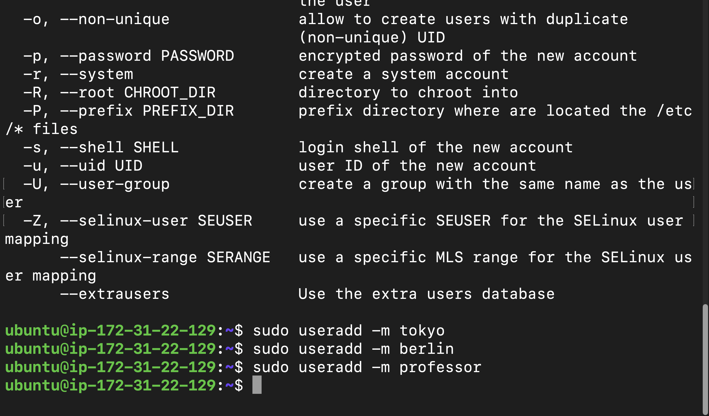
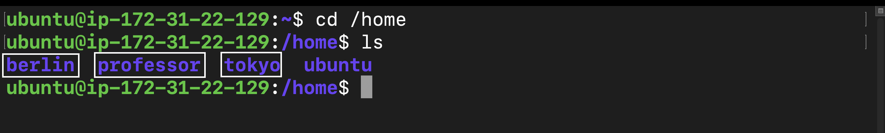
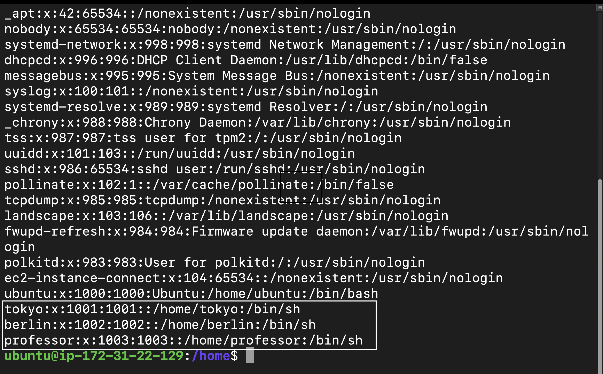
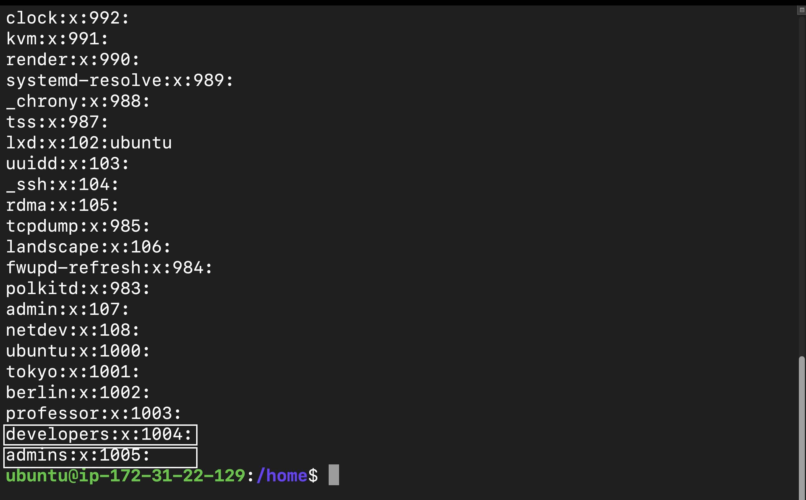
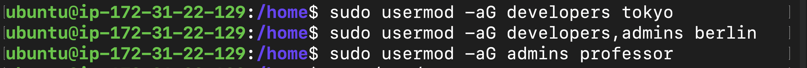
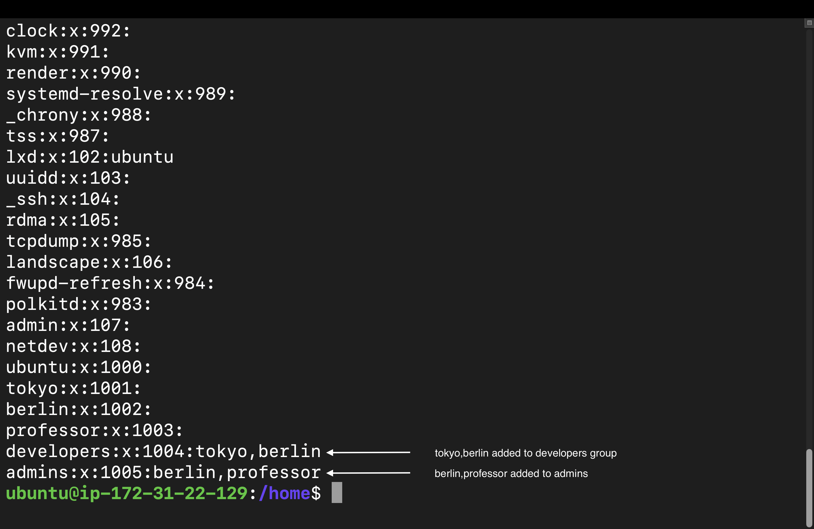
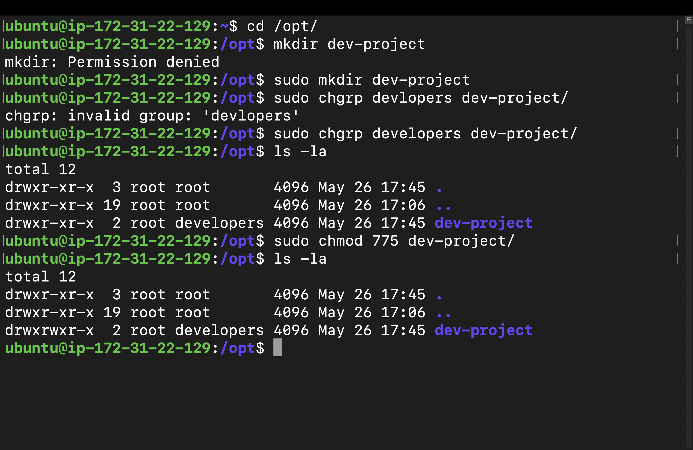
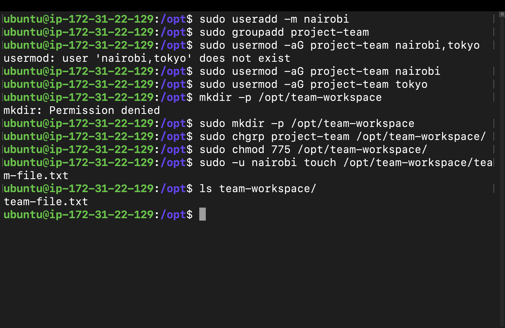

# Day 09 – Linux User & Group Management Challenge

## Introduction

Today’s learning focused on one of the most important Linux administration concepts:

> User and Group Management

In real-world DevOps environments, multiple engineers work on the same Linux servers.

That means systems must properly manage:
- Users
- Groups
- Permissions
- Shared access
- Team collaboration
- Security

Today’s challenge helped me understand how Linux controls access between different users and teams.

The tasks included:
- Creating users
- Creating groups
- Assigning users into groups
- Managing permissions
- Creating shared directories
- Testing group access

This felt very practical because these concepts are heavily used in production environments.

---

# Task 1 – Creating Users

The first task was creating multiple Linux users.

Users created:
- tokyo
- berlin
- professor

Commands used:

```bash
sudo useradd -m tokyo
sudo useradd -m berlin
sudo useradd -m professor
```

The `-m` flag automatically creates home directories inside:

```text
/home/
```

---

## Creating Linux Users



---

# Setting Passwords

Passwords were assigned using:

```bash
sudo passwd tokyo
sudo passwd berlin
sudo passwd professor
```

This helped me understand how Linux manages authentication for users.

---

# Verifying Home Directories

To verify the users and their home directories:

```bash
ls -l /home
```

This confirmed:
- Home directories were created successfully
- Each user had their own workspace

---

## Home Directories Verification



---

# Verifying Users Using /etc/passwd

To verify user accounts:

```bash
cat /etc/passwd
```

The `/etc/passwd` file stores Linux user account information.

This helped me understand:
- User IDs
- Shell information
- Home directory mapping

---

## Checking /etc/passwd



---

# Task 2 – Creating Groups

Next, I created Linux groups.

Groups created:
- developers
- admins

Commands used:

```bash
sudo groupadd developers
sudo groupadd admins
```

Groups are useful for:
- Organizing teams
- Managing permissions
- Shared access control

---

# Verifying Groups

To verify groups:

```bash
cat /etc/group
```

This file stores Linux group information.

---

## Groups Created



---

# Task 3 – Assigning Users to Groups

Next, I assigned users into groups.

Assignments:
- tokyo → developers
- berlin → developers + admins
- professor → admins

Commands used:

```bash
sudo usermod -aG developers tokyo
```

```bash
sudo usermod -aG developers,admins berlin
```

```bash
sudo usermod -aG admins professor
```

The `-aG` option:
- Adds users to supplementary groups
- Preserves existing memberships

---

## Assigning Users to Groups



---

# Verifying Group Membership

To verify memberships:

```bash
groups tokyo
```

```bash
groups berlin
```

```bash
groups professor
```

This confirmed:
- Users were assigned correctly
- Group memberships were working properly

---

## Verifying Group Membership



---

# Task 4 – Shared Directory Setup

The next task was creating a shared project directory.

Directory created:

```text
/opt/dev-project
```

Command used:

```bash
sudo mkdir -p /opt/dev-project
```

---

# Setting Group Ownership

Group owner changed to:

```text
developers
```

Command used:

```bash
sudo chgrp developers /opt/dev-project
```

---

# Setting Permissions

Permissions assigned:

```bash
775
```

Command used:

```bash
sudo chmod 775 /opt/dev-project
```

Permission breakdown:
- Owner → rwx
- Group → rwx
- Others → r-x

This allows:
- Developers to collaborate
- Others to only read

---

# Testing Shared Access

To test permissions:

```bash
sudo -u tokyo touch /opt/dev-project/tokyo-file.txt
```

```bash
sudo -u berlin touch /opt/dev-project/berlin-file.txt
```

Both users successfully created files inside the shared directory.

This confirmed:
- Group permissions worked correctly
- Shared access was configured successfully

---

## Shared Directory Configuration



---

# Task 5 – Team Workspace Challenge

Next, I created another user:

```text
nairobi
```

Command used:

```bash
sudo useradd -m nairobi
```

Password assigned using:

```bash
sudo passwd nairobi
```

---

# Creating Project Team Group

Group created:

```text
project-team
```

Command used:

```bash
sudo groupadd project-team
```

---

# Adding Users to Team Group

Users added:
- nairobi
- tokyo

Commands used:

```bash
sudo usermod -aG project-team nairobi
```

```bash
sudo usermod -aG project-team tokyo
```

---

# Creating Team Workspace

Directory created:

```text
/opt/team-workspace
```

Command used:

```bash
sudo mkdir -p /opt/team-workspace
```

---

# Setting Group Ownership

Command used:

```bash
sudo chgrp project-team /opt/team-workspace
```

---

# Setting Permissions

Command used:

```bash
sudo chmod 775 /opt/team-workspace
```

---

# Testing Team Access

To verify permissions:

```bash
sudo -u nairobi touch /opt/team-workspace/team-file.txt
```

The file was created successfully.

This confirmed:
- Shared workspace permissions worked correctly
- Team collaboration setup was successful

---

## Team Workspace Setup



---

# Important Commands Practiced

## Create User

```bash
sudo useradd -m username
```

---

## Set Password

```bash
sudo passwd username
```

---

## Create Group

```bash
sudo groupadd groupname
```

---

## Add User to Group

```bash
sudo usermod -aG groupname username
```

---

## Check User Groups

```bash
groups username
```

---

## Create Directory

```bash
sudo mkdir -p /path
```

---

## Change Group Ownership

```bash
sudo chgrp groupname /path
```

---

## Change Permissions

```bash
sudo chmod 775 /path
```

---

## Check Permissions

```bash
ls -ld /path
```

---

## Test User Access

```bash
sudo -u username command
```

---

# Biggest Learning from Today

The biggest realization from today was:

> Linux permissions are the foundation of security and collaboration.

Today helped me understand:
- How teams share resources
- How Linux controls access
- How groups simplify permission management
- How shared workspaces are configured

This is extremely important in:
- DevOps
- Cloud infrastructure
- Production servers
- Team environments

---

# Challenges Faced

## Permission Issues

Initially, some users could not access shared directories.

Reason:
- Incorrect permissions
- Wrong group ownership

Solution:
- Updated group ownership using `chgrp`
- Assigned proper permissions using `chmod 775`

---

# What I Learned

Today I learned:
- User creation
- Group management
- Linux permissions
- Shared directory setup
- Team collaboration using groups
- Access verification
- Linux security basics

---

# Final Thoughts

Today’s challenge felt very practical because it simulated real Linux administration workflows.

I successfully:
- Created users
- Managed groups
- Configured shared access
- Worked with Linux permissions
- Tested collaboration environments

And one thing became very clear:

> Good DevOps engineers must understand Linux permissions deeply.

Because infrastructure security and collaboration depend heavily on proper access control.

Day 09 completed.

Still learning. Still improving. Still building.