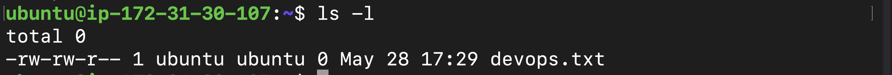
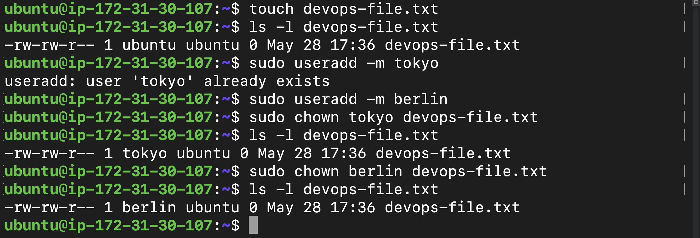
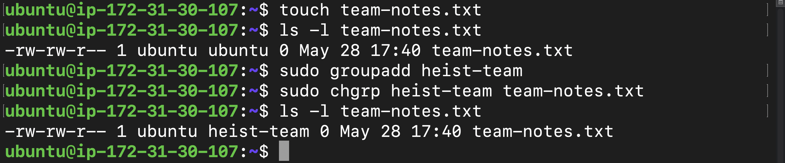
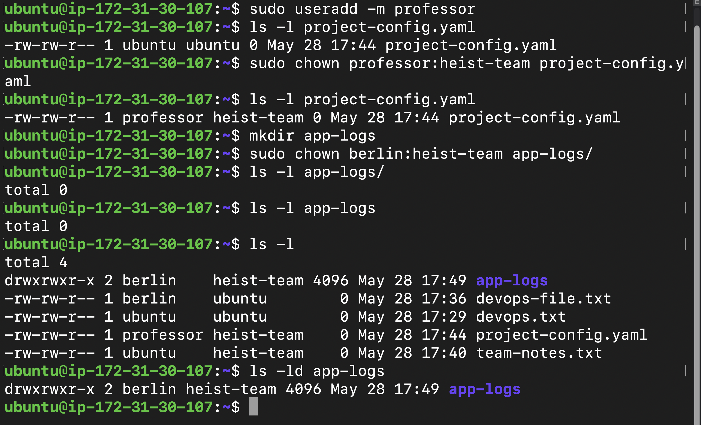
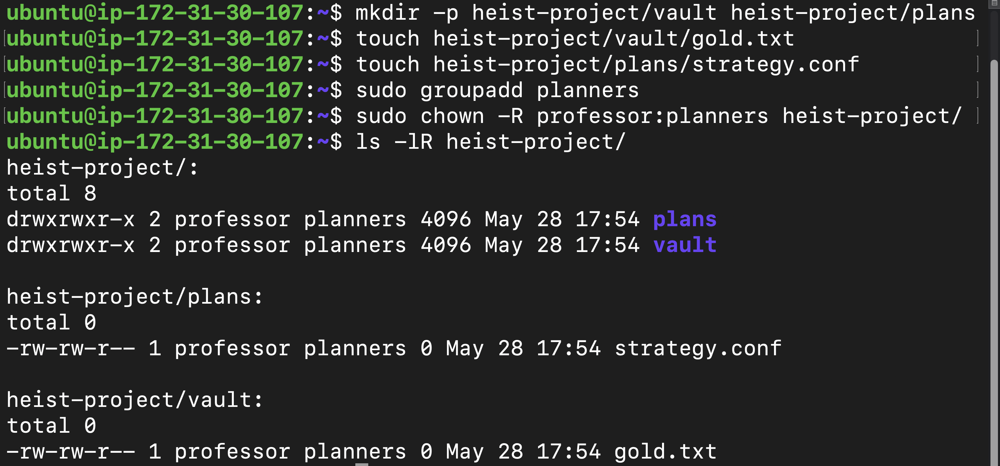
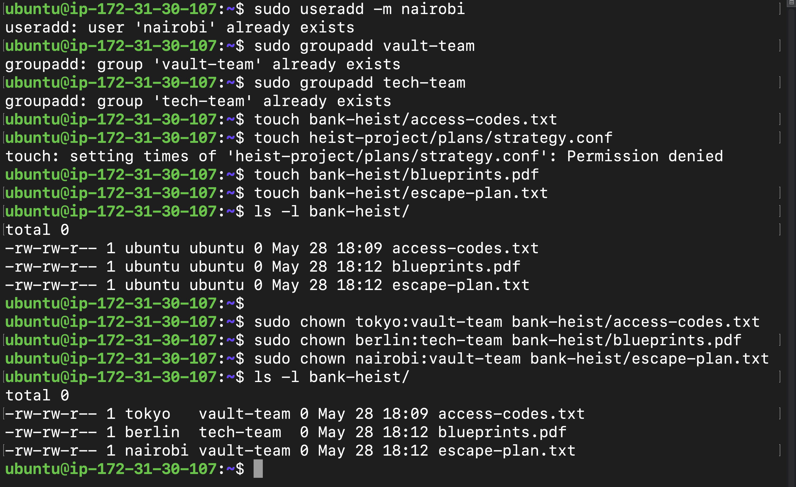

# Day 11 – File Ownership Challenge (chown & chgrp)

## Introduction

Today’s learning focused on one of the most important Linux administration concepts:

> File Ownership and Group Ownership

Until now, I had already practiced:
- Linux permissions
- Users and groups
- File operations
- chmod

But today I learned something deeper:

> Permissions decide access, but ownership decides responsibility.

In Linux, every file and directory belongs to:
- A user (owner)
- A group

This ownership system is extremely important in:
- DevOps
- Cloud infrastructure
- Shared Linux servers
- Docker containers
- CI/CD pipelines
- Application deployments

If ownership is configured incorrectly:
- Applications may fail
- Logs may stop writing
- Services may crash
- Deployments may break

Today’s challenge helped me understand how Linux manages ownership using:
- `chown`
- `chgrp`

---

# Understanding File Ownership

The first task was understanding how ownership works in Linux.

Command used:

```bash
ls -l
```

Example output:

```text
-rw-r--r-- 1 ubuntu ubuntu 0 May 28 devops.txt
```

Breakdown:
- First `ubuntu` → file owner
- Second `ubuntu` → file group

This helped me understand the difference between:
- Owner
- Group
- Permissions

One thing became very clear:

> Linux security depends heavily on proper ownership structure.

---

## Understanding Ownership



---

# Task 2 – Basic chown Operations

The next task was practicing `chown`.

I created a file:

```bash
touch devops-file.txt
```

Then checked ownership:

```bash
ls -l devops-file.txt
```

---

# Creating Users

Users created:
- tokyo
- berlin

Commands used:

```bash
sudo useradd -m tokyo
```

```bash
sudo useradd -m berlin
```

---

# Changing File Ownership

First, I changed ownership to `tokyo`:

```bash
sudo chown tokyo devops-file.txt
```

Then verified:

```bash
ls -l devops-file.txt
```

After that, I changed ownership again to `berlin`:

```bash
sudo chown berlin devops-file.txt
```

This helped me understand how ownership can be transferred between users.

---

## chown Operations



---

# Task 3 – Basic chgrp Operations

Next, I practiced changing file groups using `chgrp`.

I created a file:

```bash
touch team-notes.txt
```

Checked current group:

```bash
ls -l team-notes.txt
```

---

# Creating Group

Group created:

```text
heist-team
```

Command used:

```bash
sudo groupadd heist-team
```

---

# Changing File Group

Command used:

```bash
sudo chgrp heist-team team-notes.txt
```

Then verified:

```bash
ls -l team-notes.txt
```

This helped me understand how Linux manages group ownership separately from user ownership.

---

## chgrp Operations



---

# Task 4 – Combined Owner & Group Change

One interesting thing I learned today:

`chown` can change both:
- owner
- group

in a single command.

---

# Creating File

```bash
touch project-config.yaml
```

---

# Creating professor User

```bash
sudo useradd -m professor
```

---

# Changing Owner & Group Together

Command used:

```bash
sudo chown professor:heist-team project-config.yaml
```

This changed:
- owner → professor
- group → heist-team

Then verified using:

```bash
ls -l project-config.yaml
```

---

# Creating app-logs Directory

```bash
mkdir app-logs
```

Changed ownership:

```bash
sudo chown berlin:heist-team app-logs
```

Verified:

```bash
ls -ld app-logs
```

This demonstrated how ownership is configured for shared application directories.

---

## Combined Ownership Changes



---

# Task 5 – Recursive Ownership

This was one of the most important tasks today.

I created a directory structure:

```bash
mkdir -p heist-project/vault
```

```bash
mkdir -p heist-project/plans
```

```bash
touch heist-project/vault/gold.txt
```

```bash
touch heist-project/plans/strategy.conf
```

---

# Creating planners Group

```bash
sudo groupadd planners
```

---

# Recursive Ownership Change

Command used:

```bash
sudo chown -R professor:planners heist-project/
```

The `-R` flag means:
```text
Recursive
```

This changed ownership for:
- directories
- subdirectories
- files

all at once.

Then verified using:

```bash
ls -lR heist-project/
```

This helped me understand how large application directories are managed in Linux systems.

---

## Recursive Ownership



---

# Task 6 – Practice Challenge

The final task simulated a real DevOps-style team environment.

---

# Creating Users

User created:

```bash
sudo useradd -m nairobi
```

---

# Creating Groups

Groups created:
- vault-team
- tech-team

Commands used:

```bash
sudo groupadd vault-team
```

```bash
sudo groupadd tech-team
```

---

# Creating bank-heist Directory

```bash
mkdir bank-heist
```

---

# Creating Files

```bash
touch bank-heist/access-codes.txt
```

```bash
touch bank-heist/blueprints.pdf
```

```bash
touch bank-heist/escape-plan.txt
```

---

# Assigning Ownership

## access-codes.txt

```bash
sudo chown tokyo:vault-team bank-heist/access-codes.txt
```

---

## blueprints.pdf

```bash
sudo chown berlin:tech-team bank-heist/blueprints.pdf
```

---

## escape-plan.txt

```bash
sudo chown nairobi:vault-team bank-heist/escape-plan.txt
```

Verified using:

```bash
ls -l bank-heist/
```

This simulated how different teams manage files inside shared infrastructure environments.

---

## Practice Challenge



---

# Important Commands Practiced

## View Ownership

```bash
ls -l
```

---

## Change Owner

```bash
sudo chown username filename
```

---

## Change Group

```bash
sudo chgrp groupname filename
```

---

## Change Owner & Group Together

```bash
sudo chown owner:group filename
```

---

## Recursive Ownership

```bash
sudo chown -R owner:group directory/
```

---

# Biggest Learning from Today

The biggest realization from today was:

> File ownership is one of the foundations of Linux security and infrastructure management.

Today helped me understand:
- Ownership structure
- User responsibility
- Group collaboration
- Shared environments
- Recursive ownership management

This is extremely important in:
- DevOps
- Docker
- Kubernetes
- Cloud infrastructure
- Linux administration

---

# Challenges Faced

## Permission Denied Errors

Some ownership changes initially failed.

Reason:
- `sudo` was required for ownership operations.

Solution:
- Performed operations using root privileges.

---

## Missing Users or Groups

Some commands failed because:
- users did not exist
- groups did not exist

Solution:
- Created users and groups before assigning ownership.

---

# What I Learned

Today I learned:
- File ownership structure
- Difference between owner and group
- How `chown` works
- How `chgrp` works
- Recursive ownership changes
- Shared Linux environment management
- Linux security fundamentals

---

# Final Thoughts

Today’s challenge felt very practical because it simulated real-world Linux administration and DevOps workflows.

I successfully:
- Managed ownership
- Managed groups
- Configured shared directories
- Applied recursive ownership
- Simulated team-based infrastructure access

And one thing became very clear:

> Incorrect ownership can completely break applications, logs, deployments, and services.

That is why DevOps engineers must deeply understand Linux ownership and permissions.

Day 11 completed.

Still learning. Still improving. Still building.