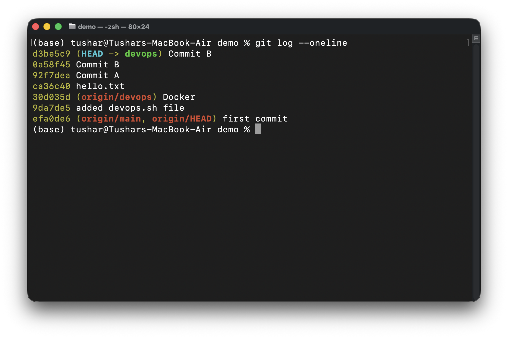
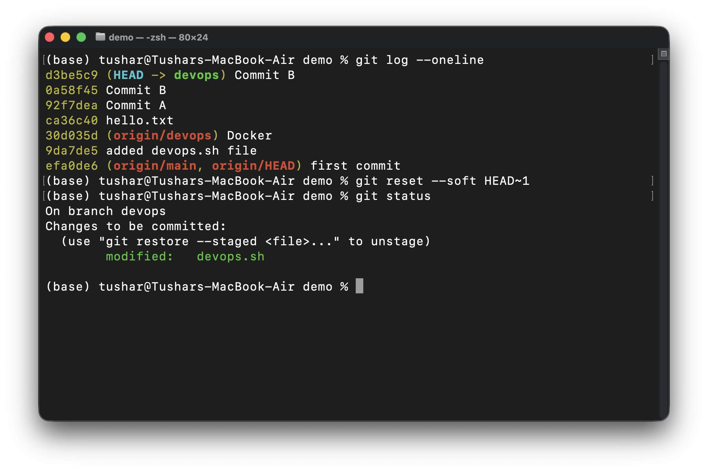
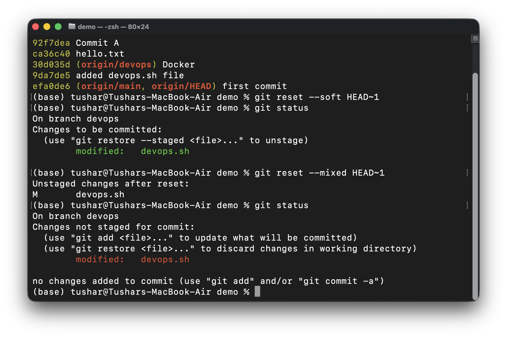
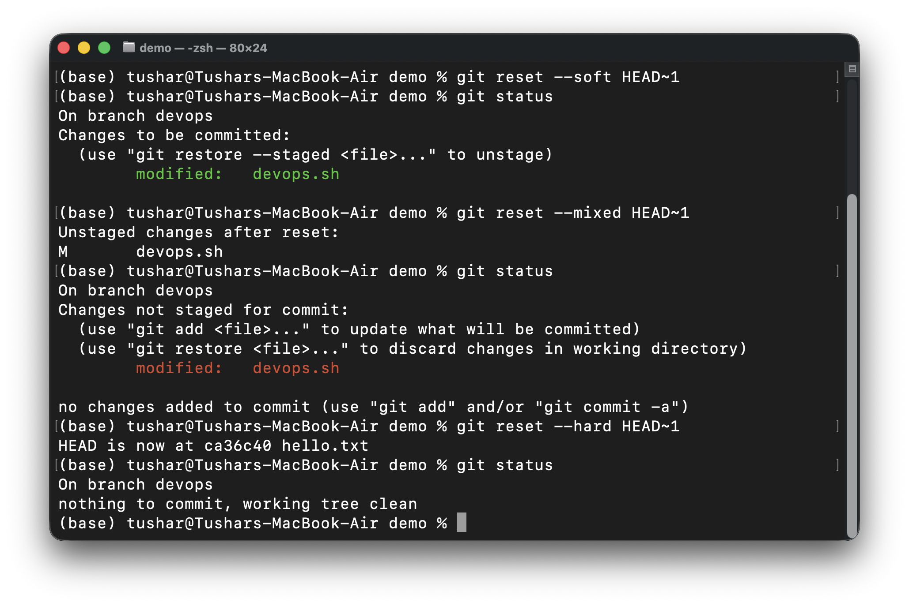
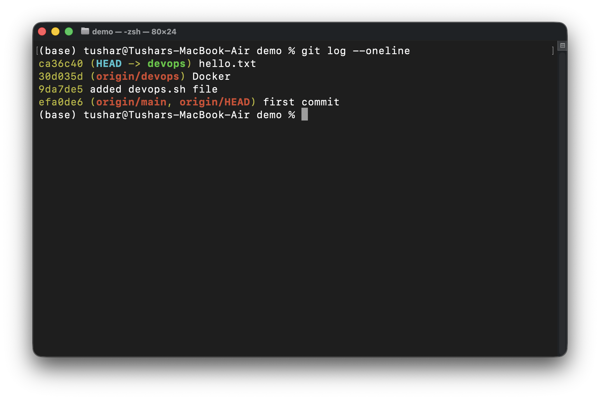
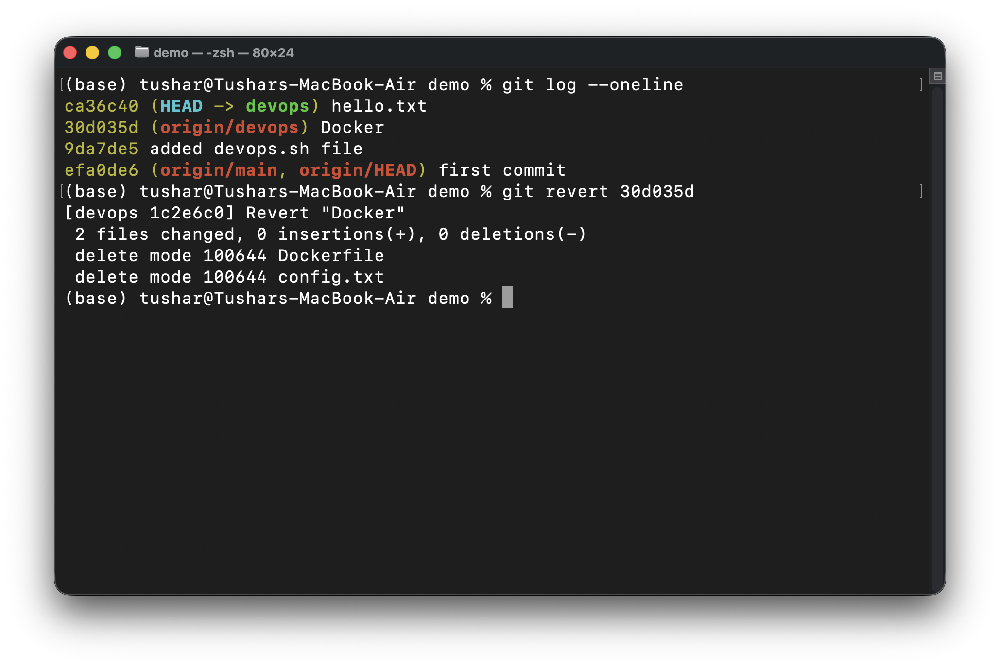
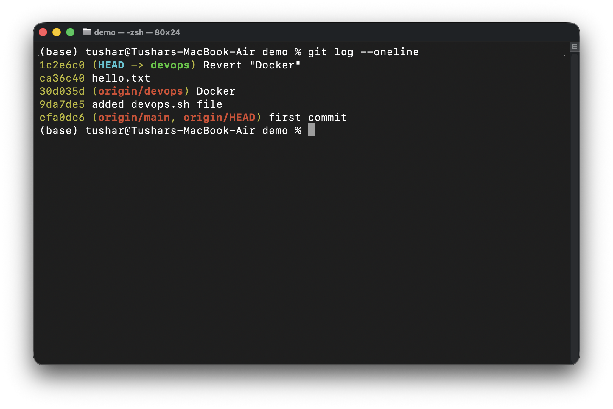
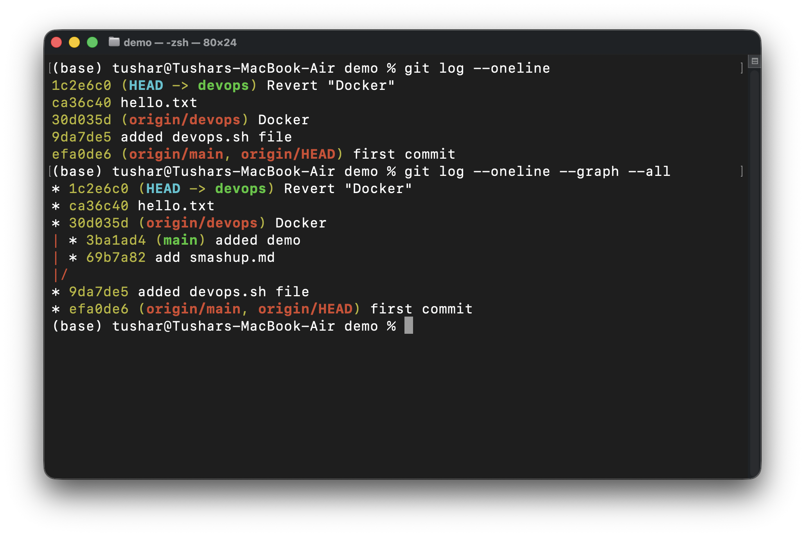

# Day 25 – Git Reset vs Revert & Branching Strategies

## Objective

Today I learned how to safely undo changes in Git using Reset and Revert. I also explored common branching strategies used by software development teams.

---

# Task 1: Git Reset

## Initial Commit History

Before performing reset operations, I created multiple commits.

### Screenshot 1



---

## Git Reset --soft

### Command

```bash
git reset --soft HEAD~1
git status
```

### Observation

* Latest commit removed from history
* Changes remain staged
* Ready to commit again

### Screenshot 2



---

## Git Reset --mixed

### Command

```bash
git reset --mixed HEAD~1
git status
```

### Observation

* Latest commit removed
* Changes remain in working directory
* Files become unstaged

### Screenshot 3



---

## Git Reset --hard

### Command

```bash
git reset --hard HEAD~1
git status
```

### Observation

* Latest commit removed
* Changes removed completely
* Working directory becomes clean

### Screenshot 4



---

## Commit History After Hard Reset

### Screenshot 5



---

## Reset Types Comparison

| Reset Type | Commit Removed | Changes Kept | Staged |
| ---------- | -------------- | ------------ | ------ |
| --soft     | Yes            | Yes          | Yes    |
| --mixed    | Yes            | Yes          | No     |
| --hard     | Yes            | No           | No     |

### Which Reset is Destructive?

`git reset --hard`

Reason:
It permanently removes commits and uncommitted changes from the working directory.

### When to Use Each?

* `--soft` → Fix commit messages or combine commits.
* `--mixed` → Unstage files while keeping changes.
* `--hard` → Completely discard unwanted changes.

### Should Reset Be Used on Pushed Commits?

No. Reset rewrites commit history and can cause problems for other collaborators.

---

# Task 2: Git Revert

## Command

```bash
git revert <commit-id>
```

### Screenshot 6



### Observation

Git created a new commit that reversed the changes introduced by the selected commit.

---

## Commit History After Revert

### Screenshot 7



### Observation

The original commit still exists in history, while Git creates a new "Revert" commit.

---

## Revert vs Reset

### How is Revert Different from Reset?

* Reset rewrites history.
* Revert preserves history and creates a new commit.

### Why is Revert Safer?

Because existing commits remain untouched, making it suitable for shared repositories and team collaboration.

### When to Use Revert?

* Shared branches
* Production fixes
* Public repositories

### When to Use Reset?

* Local cleanup
* Removing accidental commits before pushing

---

# Task 3: Reset vs Revert Summary

| Feature                        | git reset                     | git revert                               |
| ------------------------------ | ----------------------------- | ---------------------------------------- |
| What it does                   | Moves branch pointer backward | Creates a new commit that undoes changes |
| Removes commit from history    | Yes                           | No                                       |
| Safe for shared branches       | No                            | Yes                                      |
| Rewrites history               | Yes                           | No                                       |
| Recommended for pushed commits | No                            | Yes                                      |

---

# Task 4: Branching Strategies

## 1. GitFlow

### Workflow

```text
main
 │
develop
 ├── feature/*
 ├── release/*
 └── hotfix/*
```

### Used For

* Enterprise applications
* Large development teams
* Scheduled releases

### Pros

* Well organized
* Strong release management

### Cons

* Complex workflow
* Many branches to maintain

---

## 2. GitHub Flow

### Workflow

```text
main
 └── feature-branch
      └── Pull Request
           └── Merge
```

### Used For

* Startups
* SaaS products
* Continuous deployment

### Pros

* Simple
* Fast
* Easy collaboration

### Cons

* Less suitable for complex release cycles

---

## 3. Trunk-Based Development

### Workflow

```text
main
 ├── short-lived branch
 ├── short-lived branch
 └── short-lived branch
```

### Used For

* CI/CD environments
* Modern cloud-native teams

### Pros

* Faster integration
* Fewer merge conflicts

### Cons

* Requires automated testing
* Requires disciplined development

---

## Which Strategy Would I Choose?

### Startup Shipping Fast

GitHub Flow or Trunk-Based Development

Reason:
Fast development and continuous delivery.

### Large Team with Scheduled Releases

GitFlow

Reason:
Better release planning and structured workflows.

---

# Final Git Graph

### Screenshot 8



---

# Commands Learned

```bash
git reset --soft HEAD~1

git reset --mixed HEAD~1

git reset --hard HEAD~1

git revert <commit-id>

git reflog
```

---

# Key Learnings

1. Reset rewrites history while Revert preserves history.
2. Hard reset is destructive and should be used carefully.
3. Revert is the preferred option for shared repositories.
4. Reflog can help recover lost commits.
5. Different projects use different branching strategies based on team size and release process.
